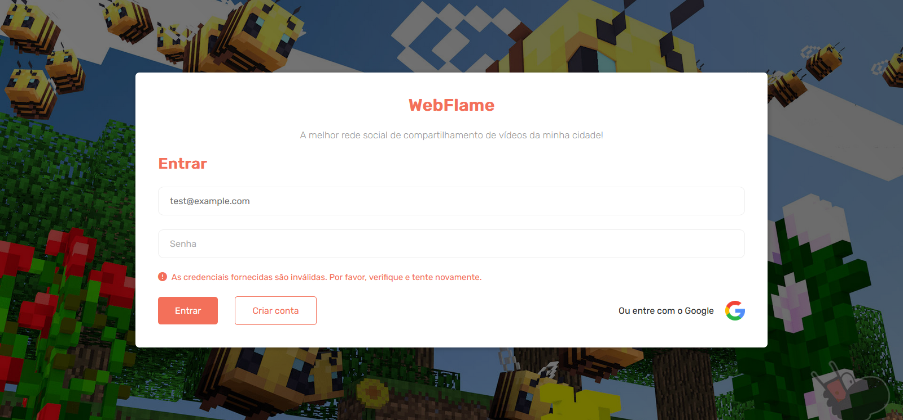
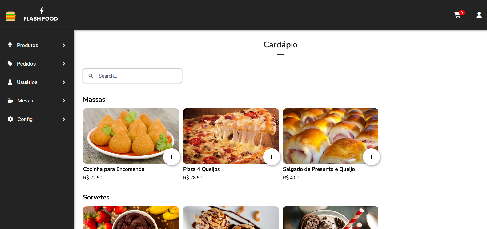
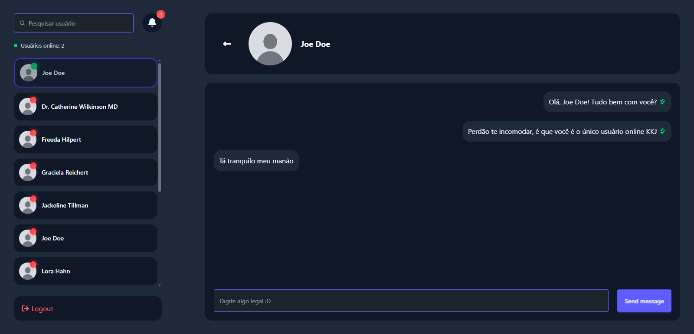
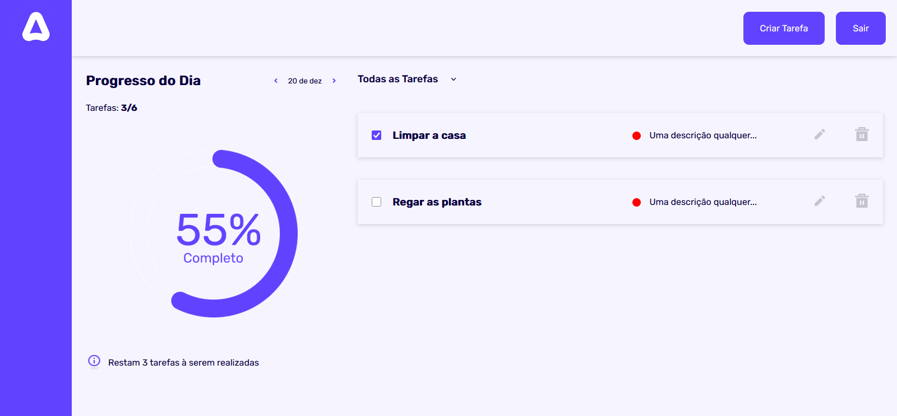
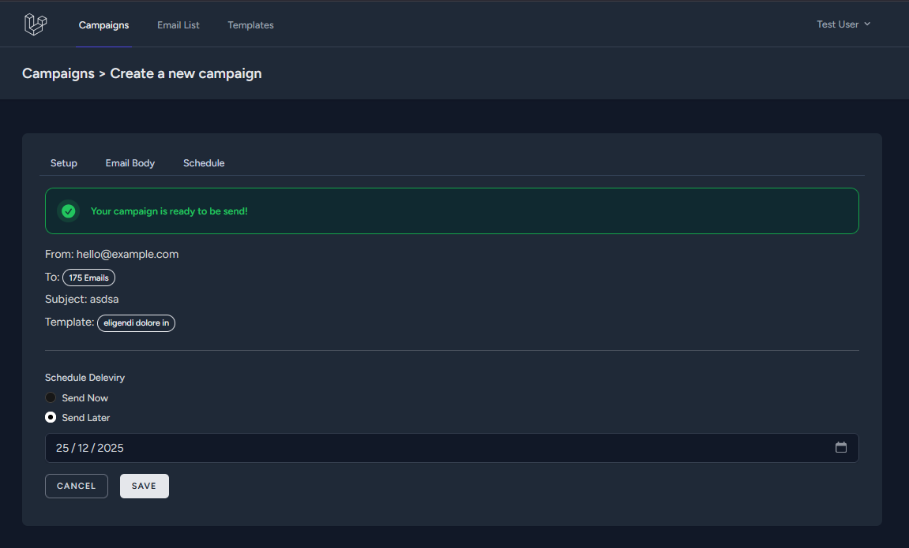
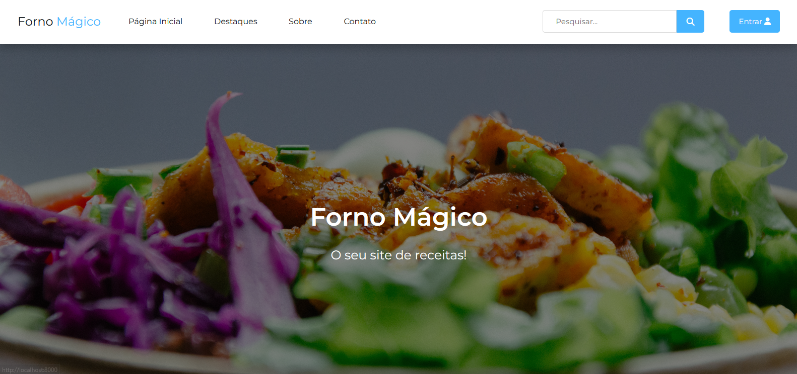
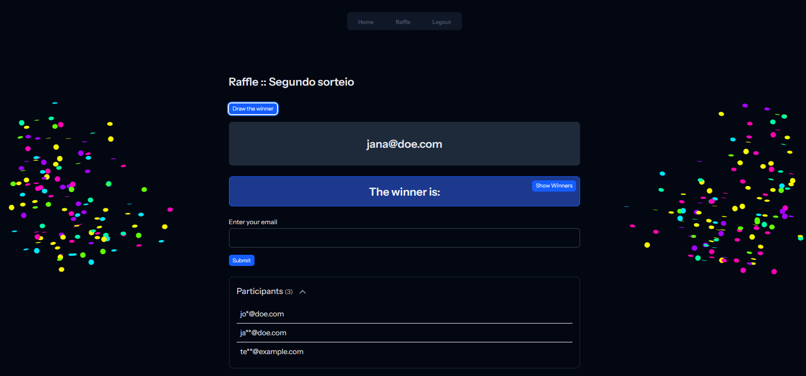
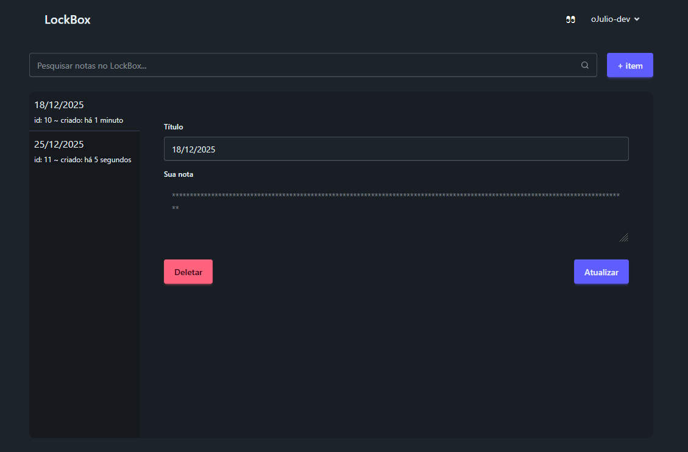
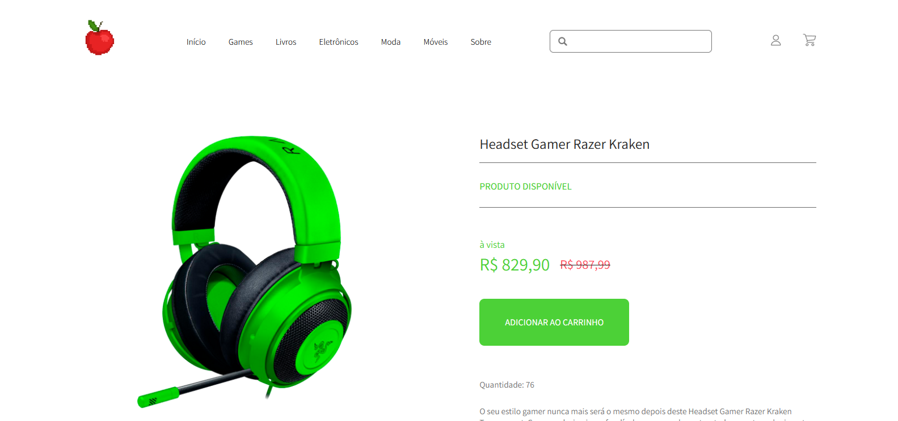
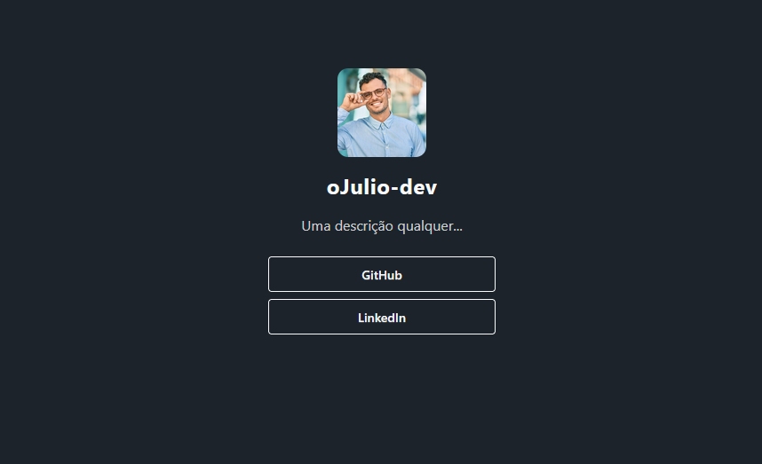

<i>oJulio-dev ~ Desenvolvedor Web</i>

<h1 align="center">Converse comigo ☕</h1>

 

 

<h1 align="center">Meus principais projetos ↷</h1>

## 👨🏻‍💻🔥 [Web Flame](https://github.com/ojulio-dev/webflame)

    

<i>Uma rede social bem completa e elegante para compartilhamento de vídeos! 📽️🚀</i>

## 🍔⚡ [Flash Food](https://github.com/ojulio-dev/flashfood)

    

<i>Um sistema bem completo e elegante para o controle de todos os pedidos do seu comércio! 🛵🍕</i>

## 🟢💬 [Online Chat](https://github.com/ojulio-dev/online-chat)

    

<i>Uma rede social para bate-papos à distância! ✉️✅</i>

## 🟣🎯 [Tasks To Do](https://github.com/ojulio-dev/tasks-to-do)

    

<i>Um dashboard bem completo e elegante para controle de tarefas e/ou hábitos! 🏆</i>

## 📧🧙‍♂️ [Blast Mail](https://github.com/ojulio-dev/blast-mail)

    

<i>Um sistema para envio de e-mails na velocidade da luz! ⚡</i>

## 🔵👨🏻‍🍳 [Forno Mágico](https://github.com/ojulio-dev/forno-magico)

    

<i>Um sistema bem completo e elegante para consultar as suas receitas preferidas! 🍙🦐</i>

## 🍀🎲 [Raffle](https://github.com/ojulio-dev/Raffle)

    

<i>Um sistema bem completo e elegante para grandes sorteios e premiações! 🎉</i>

## 🧾🔐 [Lock Box](https://github.com/ojulio-dev/lock-box)

    

<i>Um local para amarzenar com segurança, todas as suas anotações! 🧾</i>

## 🍎🛒 [Meu Ecommerce](https://github.com/ojulio-dev/meu-ecommerce)

    

<i>Um ecommerce bem completo e elegante para você fazer as suas melhores compras! 💸💸</i>

## 📈🤵🏻 [Bio Links](https://github.com/ojulio-dev/bio-links)

    

<i>Um sistema bem completo e elegante pra você disponibilizar todos os seus links profissionais! 🚀</i>

 

<h3 align="left"><i>"Toda honra e toda glória pertence ao Senhor."</i></h3>